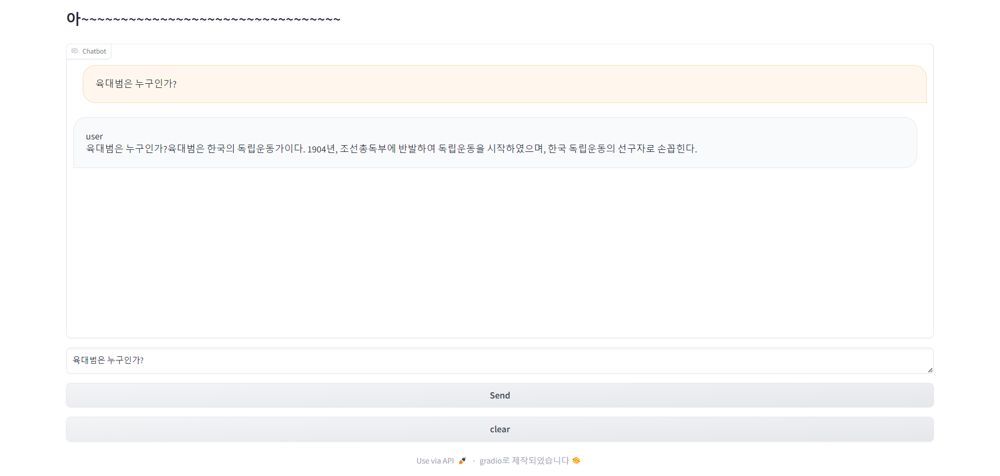
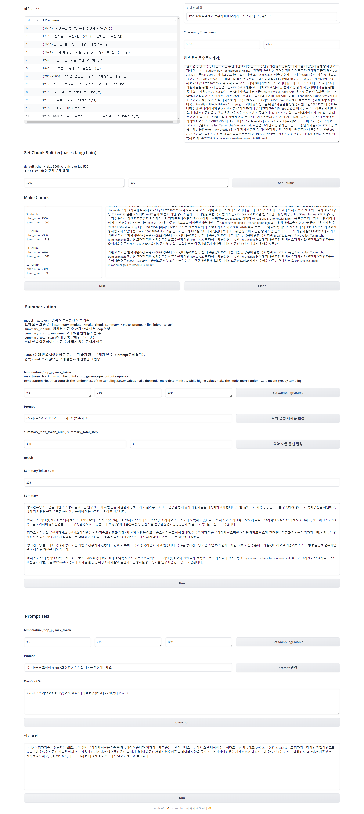

## Easy, fast, and cheap LLM serving for everyone
- vLLM is a fast and easy-to-use library for LLM inference and serving.

## version
- python 3.10, cuda 12.1

## type
- chat : 채팅
- 
- prompt_test : config 파일 설정 필수!!!!!
- 

## DIR
- chat : chat interface(+ streaming)
- llm_api : llm fast api
- prompt_test
  - config/llm_option : 초기 프롬포트 옵션, max token 옵션
  - config/llm_url : llm api url
  - config/path : 데이터 저장 경로
  - module/llm_module : 요약, 생성과 관련된 클래스
  - interface/chunk_frame : 청크 관련 llm 모듈 호출 및 이벤트 함수
  - interface/draft : Prompt Test 생성 관련 llm 모듈 호출 및 이벤트 함수
  - interface/file_datafram : 예시 데이터 관련 호출 함수
  - interface/summarization : 요약 관련 llm 모듈 호출 및 이벤트 함수
  - demo : 실행 파일, gradio layout, 클릭 이벤트 함수

## 사용 device 지정
- llm_api/vllm_api.py : os.environ["CUDA_VISIBLE_DEVICES"] = "5" <- gpu number